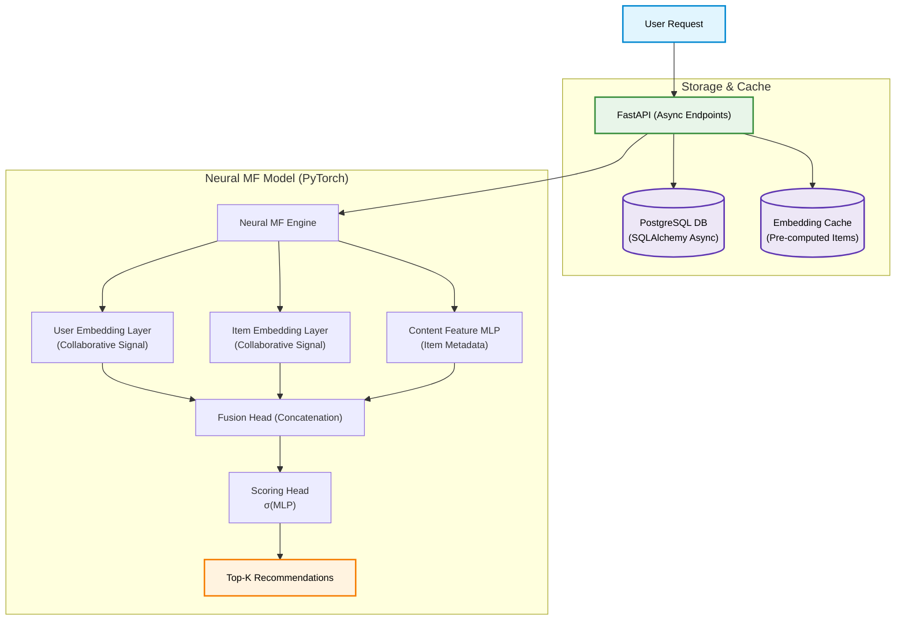
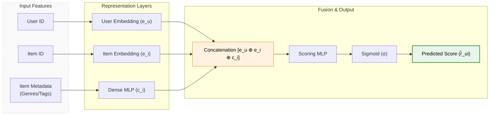

# SmartRec - Hybrid Recommendation System

A production-ready hybrid recommender combining **collaborative filtering** and **content-based signals** via a neural matrix factorization model, served through a FastAPI REST API backed by PostgreSQL.

## Architecture



---

## Tech Stack

* **Model**: PyTorch — Neural Matrix Factorization with content fusion
* **API**: FastAPI + Uvicorn (async)
* **Database**: PostgreSQL + SQLAlchemy (async)
* **Caching**: Embedding cache in PostgreSQL, Redis-ready
* **Containerization**: Docker + Docker Compose

---

## Project Structure

```text
smartrec/
├── app/
│   ├── api/routes/          # FastAPI route handlers
│   ├── core/                # Config, settings
│   ├── db/                  # Database engine, session
│   ├── models/              # SQLAlchemy ORM models
│   ├── schemas/             # Pydantic request/response schemas
│   └── services/            # Business logic (recommender, training)
├── scripts/
│   ├── train.py             # Model training entrypoint
│   └── seed_data.py         # Seed synthetic interaction data
├── tests/
│   └── test_recommend.py    # API + service tests
├── docker-compose.yml
├── Dockerfile
└── requirements.txt

```

---

## Quickstart

```bash
# 1. Start PostgreSQL
docker-compose up -d db

# 2. Install dependencies
pip install -r requirements.txt

# 3. Seed database with synthetic data
python scripts/seed_data.py

# 4. Train the model
python scripts/train.py

# 5. Run the API
uvicorn app.main:app --reload

```

API docs at `http://localhost:8000/docs`

---

## API Endpoints

| Method | Endpoint | Description |
| --- | --- | --- |
| GET | `/recommend/{user_id}` | Get top-K recommendations |
| POST | `/users/` | Create a user |
| POST | `/items/` | Create an item |
| POST | `/interactions/` | Log a user-item interaction |
| GET | `/health` | Health check |

---

## Model Pipeline & Architecture

Neural Matrix Factorization fusing two signals:

* **Collaborative signal**: learned user & item embeddings from interaction history (implicit feedback).
* **Content signal**: item metadata (genre, tags) encoded via a small MLP, concatenated with CF embeddings before the scoring head.

$$\hat{r}_{ui} = \sigma\left(MLP\left([e_u \oplus e_i \oplus c_i]\right)\right)$$

Where $e_u$, $e_i$ are learned embeddings and $c_i$ is the content feature vector.



```

```
